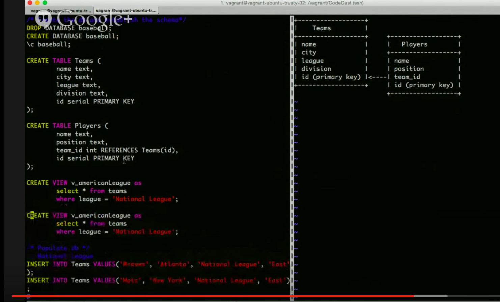

# Udacity's Tournament Database Project

## Basic

Project goals are to create a database tracking results for a swiss-style tournament. Tehcnologies used are Python, PostgreSQL, and using Vagrant / VMs. 

## How to Use
To access the database, navigate to this project's vagrant/tournament folder and follow the instructions in the provided README.

